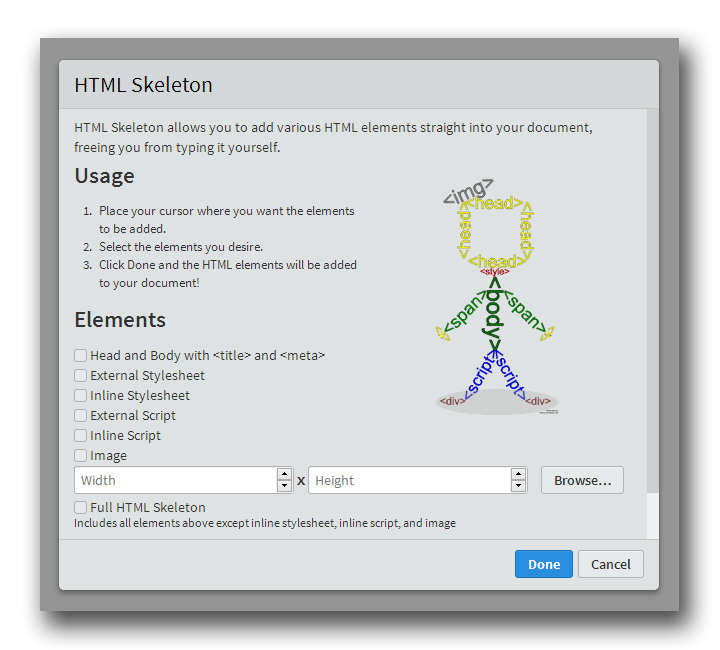

# HTML Skeleton: RCC Patch #

> A fork of [HTML Skeleton](https://github.com/le717/brackets-html-skeleton), a [Brackets](http://brackets.io) extension that allows you to easily insert a variety of HTML elements into your document.

# Installation #
Download `.zip` directly from GitHub using either the [latest revision](https://github.com/Rannison/brackets-html-skeleton-RCC-Patch/archive/RCC-Patch.zip) or [tagged release](https://github.com/Rannison/brackets-html-skeleton-RCC-Patch/releases) and drag it onto the "Drag .zip here" area in the Extension Manager.

# Usage #
1. Place your cursor in the location you want to insert the elements
2. Open the dialog by going to `Edit > Insert HTML Elements`
3. Select the desired elements, and press Done
4. Fill in all blank attributes as needed

# News #
See [NEWS.md](NEWS.md) for all changes.

# License #
[MIT License](LICENSE)

Created 2014-2015 [Triangle717](http://le717.github.io)

Logo created by [**@rioforce**](https://github.com/rioforce) ([http://rioforce.wordpress.com](http://rioforce.WordPress.com)).
